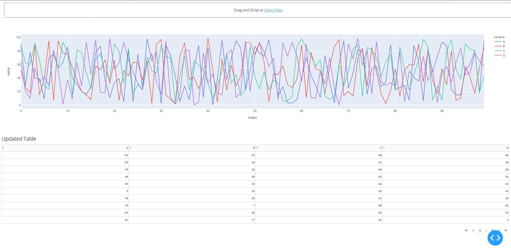

# DataView - dash
This is a simple data viewer (a plotly figure and a dash table)

## Install dash
```
pip install dash==1.17.0
```

## Example


## References
* https://dash.plotly.com/datatable/callbacks
* https://dash.plotly.com/datatable/editable
* https://dash.plotly.com/dash-core-components/upload